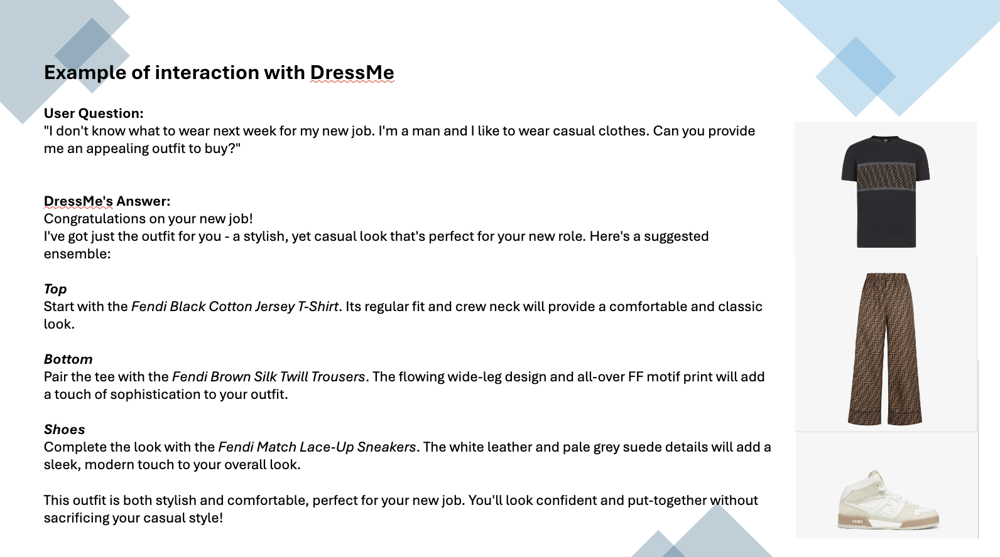

# 👗 DressMe ✨

DressMe was developed during the [DATA + AI SUMMIT 2024 GENAI HACKATHON](https://www.databricks.com/dataaisummit/session/data-ai-summit-2024-genai-hackathon). The hackathon challenge was to create a new application using an open-source large language model (LLM) such as Llama3, Mixtral, DBRX, among others. Participants were encouraged to use Databricks for their projects and leverage datasets available on the Databricks Marketplace. The goal was to showcase innovative uses of open LLM models in practical applications.

### Project Overview

DressMe use Databricks Vector Search integrating a Databricks Foundation Model API embedding model (`llama-3-70b-instruct`).

Retrieval-augmented generation (RAG) is one of the most popular application architectures for creating natural-language interfaces for people to interact with an organization's data. This notebook builds a very simple RAG application, with the following steps:

1. Set up a vector index and configure it to automatically use an embedding model from the FMAPI to generate embeddings.
2. Load some fashon products data into the vector database
3. Query the database 
4. Build a prompt for an LLM from the query results 
5. Query an LLM via the FMAPI, using that prompt

The objective of this project is to develop an automated system that utilizes a large language model (LLM) to extract clothes recommendation from input text requests.

DressMe will recommend your entire outfit for your event, comprehensive of top, bottom and shoes!

### Project Code 

To access to project code, use the following [notebook](./notebooks/dressme-luxury-fashion-rag.ipynb).
Also few slides are available in the following [presentation](./presentation/presentation.pdf).

### Example of interaction

#### Input Text Processing:

Users will provide text inputs, which could be in the form of customer service queries, emails, chat messages, or other unstructured text formats.
Example input: "I don't know what to wear next week for my new job. I'm a male an I like to wear casual clothes. Can you provide me an appelling outfit to buy?"

### User interaction

Users will provide text inputs, which could be in the form of customer service queries, emails, chat messages, or other unstructured text formats.

Integration of Meta Llama Model to analyze the input text, understand the context and extract relevant fashion products.

### Technical Stack
- Databricks ChatSession
- Databricks VectorSearch
- Language Model: Meta LLama 3
- Programming Language: Python

## Contributors ✨

Team 4:

- Giuseppe Murro - [gmurro](https://github.com/gmurro) - `giuseppe.murro@giorgioarmani.it`
- Gianluca Sarà - [gians14ga](https://github.com/gians14ga) - `gianluca.sara@giorgioarmani.it`
